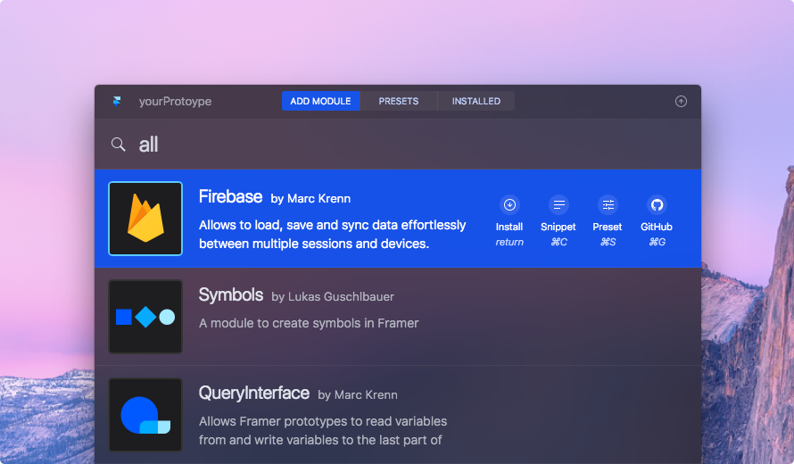
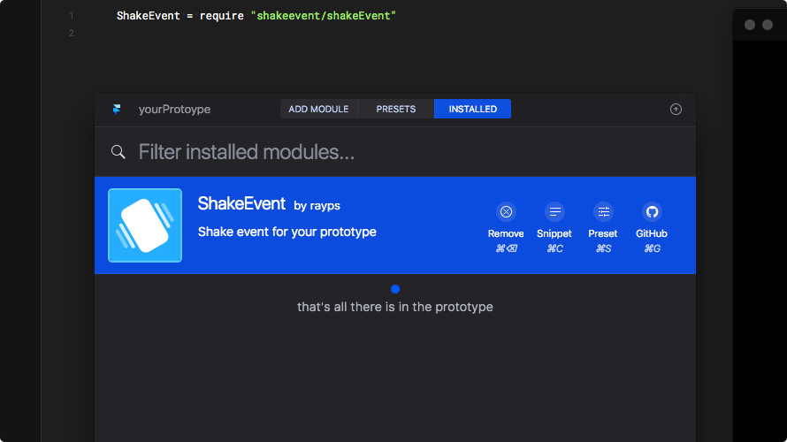
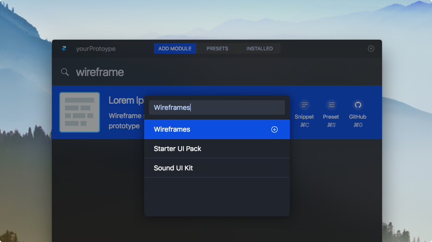
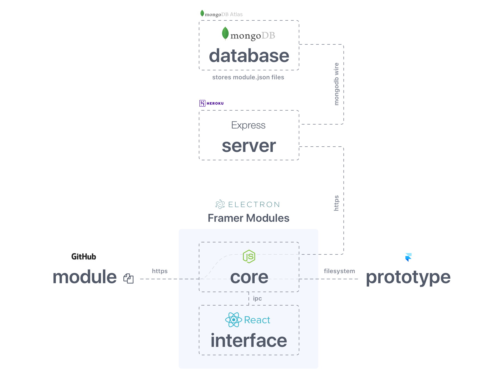

<h3 id='framer-modules-start' align='center'>
    
</h3>

<h1 id='framer-modules' align='center'>Framer Modules</h1>
<h3 align='center'>Discover, install and save your favorite modules at one place</h3>

<h4 align='center'>
    
</h4>
<h3 align='center'>
    
</h3>

 

## :sparkles: Discover
Looking for the right module used to be time-consuming and annoying—you didn't know if
a module for the job exists, you weren't sure where to look for it and you had to
manually download and move the files just to try things out.

Not anymore. Search for what you need and discover new useful modules without
disrupting your workflow during prototyping. Not sure what's available? Try **'all'**

 

## :zap: Install
Tired of downloading and copying modules to the prototype on your own?
We all are. That's why installing modules is now so easy even your grandma
can do it. Seriously, it's just “press <kbd>Enter</kbd>”.

All modules ship with example code snippets. When you're not yet familiar with
how a module works, press <kbd>Cmd</kbd> <kbd>C</kbd> and paste the code in Framer.

Found out you don't need the module anymore? Press <kbd>Cmd</kbd> <kbd>Backspace</kbd>
and say bye *(the latter is optional)*.

###### Please make sure your prototype is saved before installing a module.

 

## :heart: Save
Yes, it's true. You can now save your favorite or regularly used modules in presets
and install them to the prototype in batch with one button. Making wireframe prototype?
Install these. Doing VR? Install those. Anything you need.

Just press <kbd>Cmd</kbd> <kbd>S</kbd> on a selected module, add it to a preset
or create new one and save even more time!

 

### All the shortcuts you'll ever need

| Action                                    | Shortcut                            |
| ------------------------------------------|-------------------------------------|
| **Open Framer Modules window**            | <kbd>Cmd</kbd> <kbd>;</kbd>         |
| Switch between individual tabs            | <kbd>Tab</kbd>                      |
| Close the window                          | <kbd>Esc</kbd>                      |
| **Selected module**                       |                                     |
| Install selected module                   | <kbd>return</kbd>                   |
| Copy the code snippet for selected module | <kbd>Cmd</kbd> <kbd>C</kbd>         |
| Save the module to a preset               | <kbd>Cmd</kbd> <kbd>S</kbd>         |
| Go to module's GitHub repository          | <kbd>Cmd</kbd> <kbd>G</kbd>         |
| Remove module                             | <kbd>Cmd</kbd> <kbd>Backspace</kbd> |
| **Selected preset**                       |                                     |
| Install modules from preset               | <kbd>return</kbd>                   |
| Delete preset                             | <kbd>Cmd</kbd> <kbd>Backspace</kbd> |
| Edit preset modules                       | <kbd>Cmd</kbd> <kbd>E</kbd>         |

The “community-driven” part in the description is not just an empty phrase.
This app is developed by the same people who are using it. If you are
one of them (actually... us) and want to make our modules registry/manager even
better, **you're more than welcome to contribute**.

This part of the docs will hopefully acquaint you with the inner workings of
the whole system.

## Architecture

### Hosting the modules and `module.json`
Due to this project's open-source nature, the modules' management was designed
to be as easy as possible and seamlessly integrated with other technologies
available.

That's why there is **no own** server **hosting** the actual modules files.
Instead, **modules are hosted on GitHub** and recognized by their **`module.json`**
metadata file. Upon the installation, module files are pulled from the GitHub
repository as specified in *module.json* and installed to the prototype.

That is why we don't need our own fileserver and why the **Framer Modules registry
is basically just a database holding modules' `module.json` files**.

Hosting on GitHub also provides us the perks of **not needing user accounts**.
When the module is published to the registry, it carries the information
about the author in its repository link. This is enough to recognize the author
and give them the permissions to update and overwrite. Publishing or updating
a module with the same name from a different GitHub user is automatically rejected.

### System Components & Technology stack
You can say the whole system consists of 3 major parts:

- **[Framer Modules app](#framer-modules-app)** — The main app for the designer
                                            that handles the prototype management
- **[Server](#server)** — Small server for communication with the modules registry
- **[Modules Registry](#modules-registry-database)** — Collection of modules
                                            metadata in database

<h3 id='framer-modules-app'>
    
    Framer Modules App
</h3>

Is built on [**`Electron`**](https://electron.atom.io) and handles all actions
related to prototype management. The app is split into two parts that communicate
with each other using `ipcMain` and `ipcRenderer` modules from Electron.

#### Core
The `main` Electron process that is responsible for all 3 main types of actions being taken.

First is communication with the renderer process via `ipc`. Literally all methods for this
are defined in self-titled `Actions.js`. Some methods also preprocess the responses
before sending them back to renderer process, but otherwise they're pretty straightforward.

Second type of actions is HTTP requests. Although the requests are being used throughout
the whole core and aren't defined at one place, they all use
[**`request`**](https://www.npmjs.com/package/request) package to make the calls.
However, methods for making the requests to the Framer Modules server share many properties
and thus are defined in `ServerRequest.js`.

And last but not least, the actions that actually handle the prototype are to be found
in `prototype-actions` subdirectory. The functions are fed `module.json`
(or an array of those) and prototype's path. Using `request`, they then **pull the files**
from the corresponding GitHub repository as defined in the JSON and **pipe them** to
the module-specific subfolder in prototype's `modules` directory.

If the un/installation is successful, the core will update prototype's
`app.coffee` (by adding/removing `require()` statement) and
`framer/config.json` (by recalculating folded code ranges). If any error occurs during
the installation, the whole module gets removed.

Installed modules are also recognized by directory name and `module.json` inside.
Any loose files or directories without `module.json` will result in “unmanaged” modules.

#### Interface
Interface is written with [**`React`**](https://facebook.github.io/react/) and
although we are *not* using any “single source of truth” state container,
**the state** for the most of the app **is stored within a single**, highest-level,
component. There are two components that have their own state, `Splash` and
`ModalWindow`, and the reasons for those are pretty obvious in use.

Please note that because I couldn't get `webpack` to bundle `ipcRenderer` module
from Electron, the methods for communication between the two processes are defined
in the separate `Action.js` file loaded to the page via `<script>`.

To further inspect the React component structure, use `electron-react-devtools`.
The package is installed as a dev dependency, you'll just need to
[require it](https://github.com/firejune/electron-react-devtools#installing)
in the app window's console.

Styles are written in [**`Sass`**](http://sass-lang.com/guide) and split into
individual files corresponding to React components. All SVG assets are Base64-encoded
and saved as data URIs in `_assets.sass` file.

<h3 id='server'>
    
    Server
</h3>

Small REST server for communication with the modules registry and data
preprocessing. Separating this functionality from the app enables using the
registry in more general ways.

The server is written in [**`Express.js`**](https://expressjs.com) and uses
[**`Mongoose`**](http://mongoosejs.com) for easier data modeling, validation, etc.

Currently deployed on the [Heroku](https://www.heroku.com/home) Free Dyno.
The source code for the server lies in its own repository.

<a href='https://github.com/kysely/framer-modules-server'>
    
    Go to server's repository
</a>

<h3 id='modules-registry-database'>
    
    Modules Registry (Database)
</h3>

Simple as it sounds. The database of choice is [**`MongoDB`**]
(https://www.mongodb.com/what-is-mongodb) and is currently deployed on the free
[MongoDB Atlas](https://www.mongodb.com/cloud/atlas) cluster.
Data modeling of the collection is very straightforward and you will be able to
to understand it from the Mongoose Schema in the server's source code or docs.

### How it looks together?

## Design
The whole app is designed in **Sketch** and you can find the source file
in `resources` folder in this repository.

Please comply to **WCAG 2.0 Level AA**. Although the app is supposed to be
used by fairly small group of people, standard accessibility concepts will make
the experience better for everyone. For color scheme checking, using
[Stark](http://www.getstark.co) is recommended.

Since the app is most useful to the user in Framer Code view, it's **designed
to be mainly operated from the keyboard.** Current design is heavily inspired by
[macOS Spotlight](https://support.apple.com/en-us/HT204014) and
[Sketch Runner](http://sketchrunner.com) (which are both keyboard-first utilities)
and you are welcome to redesign it from scratch if you have better design
in mind. Please just make sure the app is always operable from the keyboard.

## Related Repositories
- [Framer Modules server](https://github.com/kysely/framer-modules-server)
- [FramerModules.com (including subdomains)](https://github.com/kysely/framermodules.com)

## Got questions about your contribution?
[Open an issue](https://github.com/kysely/framer-modules/issues) |
[Send me an e-mail](mailto:kyselyradek@gmail.com) |
[Reach me on Messenger](https://m.me/kysely)

---

## Disclaimer
This is a third-party project and is not affiliated with [Motif Tools BV](https://framer.com).

## License
[MIT](https://github.com/kysely/framer-modules/blob/master/LICENSE)
